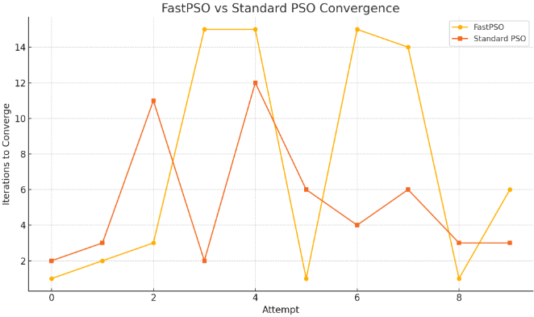

# FastPSO: A Modified Particle Swarm Optimization Algorithm


## 🧠 What is FastPSO?

**FastPSO** is a modified version of the classic Particle Swarm Optimization (PSO) algorithm, created as part of an academic exploration during the 2nd year of B.Tech. It focuses on accelerating convergence — making the search “fast enough” while still keeping solutions “good enough.”

This project introduces **four simple but impactful modifications** to the original PSO, aimed at improving search efficiency in low to mid-dimensional spaces.

---

## 🎯 Motivation

Heuristics and metaheuristics aim for “good enough solutions in a fast enough manner.”  
FastPSO focuses on improving the **fast** part without losing the **good**.

---

## 🔍 Key Modifications Over Standard PSO

1. **Uniform Initialization of Positions**
   - Divides the search space into `n` blocks and initializes one particle per block.
   - Ensures better initial coverage of the space.

2. **Non-Zero Initial Velocities**
   - Particles start with small initial velocity instead of zero to enable faster movement from the beginning.

3. **Forced Movement of One Particle to Gbest**
   - In each iteration, a randomly chosen particle is moved directly to the current global best to speed up convergence.

4. **Position Update Only if Fitness is No Worse**
   - A position is updated only if the new fitness is equal to or better than the current one.

---

## 🧪 Test Function (1D Example)

The algorithm has been initially tested on the following function:

```math
f(x) = -x^2 + 10x + 20 \quad \text{where } x \in [-10, 10]
```

---

## 📊 Results

| Attempt | FastPSO Iterations | x (FastPSO) | y (FastPSO) | Standard PSO Iterations | x (PSO)    | y (PSO)     |
|---------|--------------------|-------------|-------------|--------------------------|------------|-------------|
| 1       | 1                  | 5.00000     | 45.0000     | 2                        | 5.01834    | 44.9997     |
| 2       | 2                  | 4.98398     | 44.9997     | 3                        | 5.02813    | 44.9992     |
| 3       | 3                  | 4.99617     | 45.0000     | 11                       | 5.03322    | 44.9989     |
| 4       | 15                 | 4.99406     | 45.0000     | 2                        | 5.01316    | 44.9998     |
| 5       | 15                 | 4.95687     | 44.9981     | 12                       | 5.04163    | 44.9983     |
| 6       | 1                  | 5.00000     | 45.0000     | 6                        | 5.00898    | 44.9999     |
| 7       | 15                 | 5.03181     | 44.9990     | 4                        | 5.02634    | 44.9993     |
| 8       | 14                 | 4.99055     | 44.9999     | 6                        | 4.95814    | 44.9982     |
| 9       | 1                  | 5.00000     | 45.0000     | 3                        | 4.95502    | 44.9980     |
| 10      | 6                  | 5.02383     | 44.9994     | 3                        | 4.98970    | 44.9999     |

🟢 **FastPSO Best Case:** 1 iteration  
🔵 **PSO Best Case:** 2 iterations  
📈 **FastPSO Average:** ~5.2 iterations  
📉 **PSO Average:** ~5.2 iterations  

The following graph compares the number of iterations required for convergence between FastPSO and standard PSO across 10 runs.



⚠️ Note: This is an early prototype and not yet benchmarked on large-scale functions.

## 🔭 Future Work

- Benchmark FastPSO on standard test functions (Rastrigin, Ackley, Rosenbrock, etc.)
- Extend to multi-dimensional search spaces.
- Analyze convergence trends over time.

## 🤝 Contributing

This project is a learning and experimentation initiative started during my B.Tech.  
If you find this interesting or have ideas to improve FastPSO, **feel free to contribute or collaborate**!

Whether it's:
- Testing on new benchmark functions
- Optimizing code
- Improving visualizations
- Extending FastPSO to higher dimensions

...your input is welcome!

### 📫 Contact

Feel free to reach out to me via:

- 📧 Email: bharadwajnitw@gmail.com  
- 🌐 GitHub: [@Bharadwaj721](https://github.com/Bharadwaj721)

I'd be happy to discuss, collaborate, or just hear your thoughts!

## 📄 License

This project is licensed under the **MIT License** — see the `LICENSE` file for full details.


